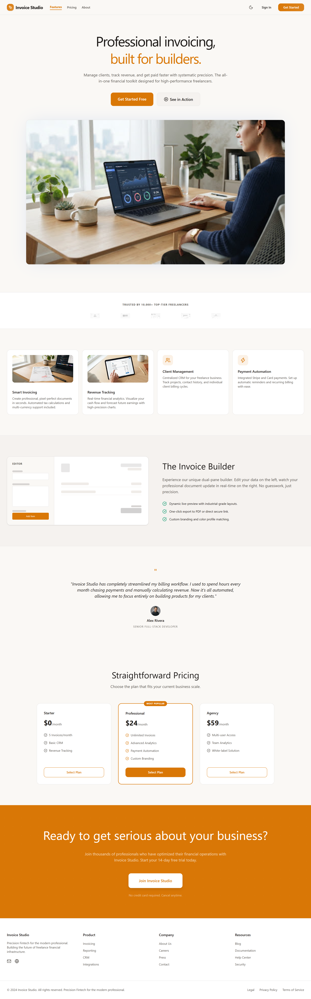
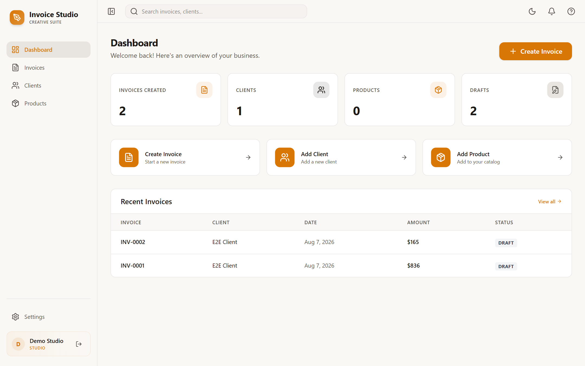
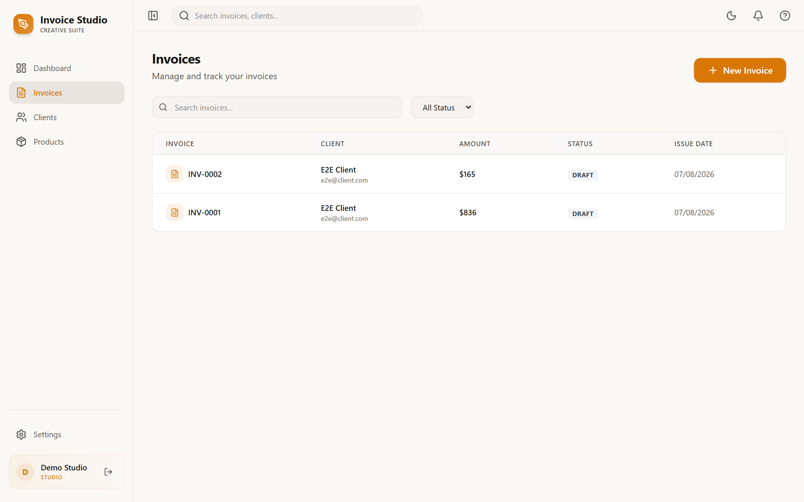
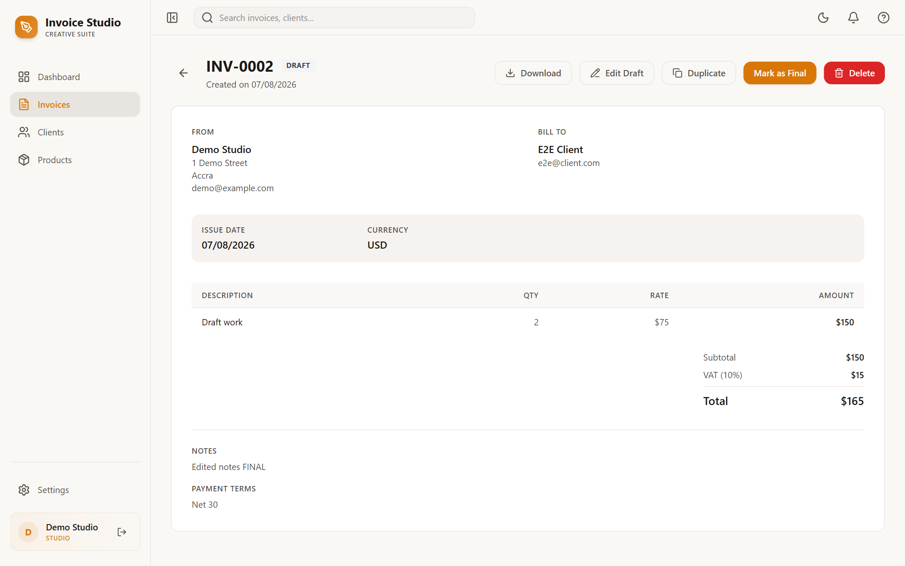
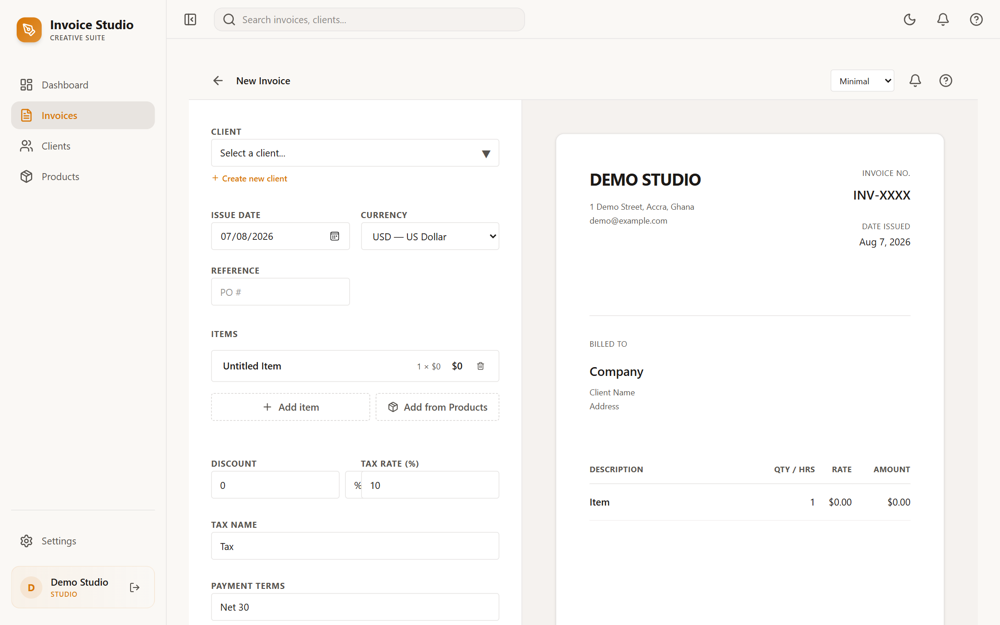

# Invoice Studio

A full-stack invoicing application for freelancers and small businesses: create and manage clients, products, and invoices, generate PDFs, print invoices, and download them — with live previews, multiple invoice templates, payment details, and a fully responsive UI.

## Repository layout

```
invoice-app/
  backend/    FastAPI + SQLAlchemy + Alembic API    → docs: backend/README.md
  frontend/   React 19 + Vite + Tailwind SPA        → docs: frontend/README.md
```

## Stack overview

| Layer    | Technology |
| -------- | ---------- |
| Backend  | FastAPI, SQLAlchemy 2.0, Alembic, SQLite (default), Pydantic v2, `uv` |
| Frontend | React 19, TypeScript, Vite 8, Tailwind CSS v4, TanStack Query, React Router, Zod |

## Quickstart

Requirements: Python 3.12+, [uv](https://docs.astral.sh/uv/), Node.js 20+, npm.

```bash
# 1. Backend (API on http://localhost:8000)
cd backend
uv sync
uv run uvicorn app.main:app --reload

# 2. Frontend (SPA on http://localhost:5173)
cd ../frontend
npm install
npm run dev
```

Open `http://localhost:5173` and sign in — or use the seeded demo account: `demo@example.com` / `demo1234`.

The frontend calls the backend at `http://localhost:8000/api` by default (override with `VITE_API_URL`); the API accepts these origins via CORS.

## Migrations

The backend runs Alembic migrations automatically on startup. For the manual workflow (generate, upgrade, current), see `backend/README.md`. Schema changes are applied in place — existing databases are migrated without being dropped or losing data.

## Tests

- Backend: `cd backend && uv run pytest`
- Frontend lint: `cd frontend && npm run lint`

## Screenshots

| | |
| :-: | :-: |
|  |  |
| Landing | Dashboard |
|  |  |
| Invoices | Invoice detail (full-width) |
|  | |
| Create invoice — editor + live preview | |

## Feature highlights

- Client, product, and invoice management with search, tabs, and archiving
- Draft → Final workflow with live previews and selectable templates (Minimal, Corporate, Modern, Agency, Elegant)
- Multi-currency (USD, EUR, GBP, GHS, CAD, AUD), discounts, taxes, and notes
- PDF generation and print-ready invoice sheets
- HttpOnly cookie authentication
- Light/dark theming and fully responsive layout, including a mobile drawer nav